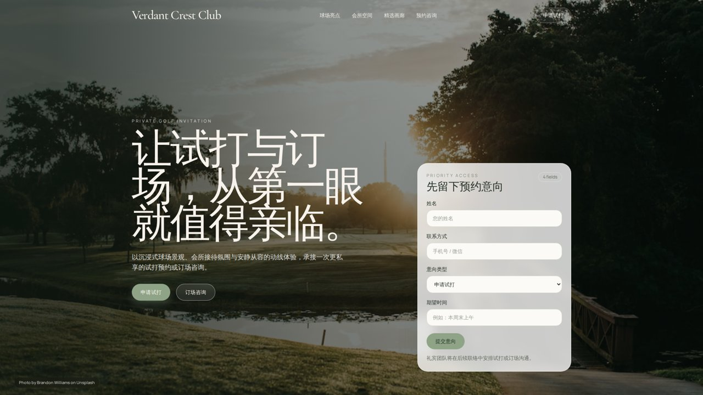
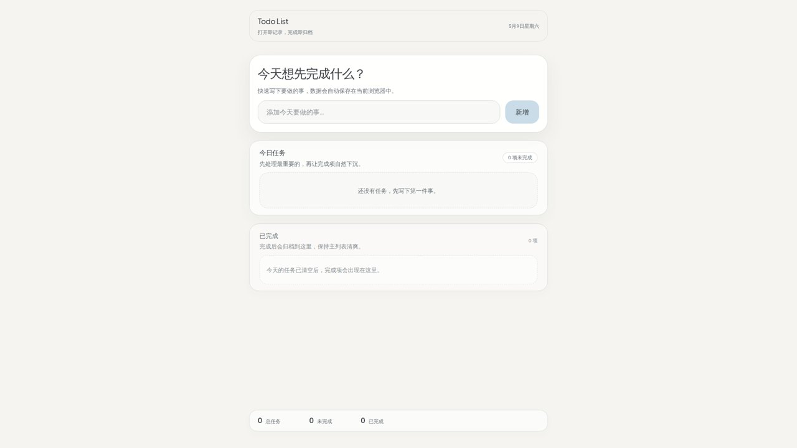

# Polaris

Polaris is an AI full-stack application building platform for end users.
The platform turns a natural-language request into working code, real
browser-verified behavior, Git-backed versions, and one-click Docker +
Traefik-routed deployments at `<uuid>.prod.${POLARIS_DOMAIN}`.

First messages route through a **discovery agent** (LangGraph: clarifier
→ references → brief compiler → mood board generator) to produce a
design brief and a generated visual mood board before Codex takes over.
Subsequent messages run Codex directly with plan / build modes.

## Documentation

- [README · 中文](./README.zh.md)
- [Development](./docs/DEVELOPMENT.md) · [中文](./docs/DEVELOPMENT.zh.md)
- [Staging](./docs/STAGING.md) · [中文](./docs/STAGING.zh.md)
- [Architecture](./docs/ARCHITECTURE.md) · [中文](./docs/ARCHITECTURE.zh.md)
- [API Reference](./docs/API.md) · [中文](./docs/API.zh.md)
- [Configuration](./docs/CONFIGURATION.md) · [中文](./docs/CONFIGURATION.zh.md)
- [Frontend](./docs/FRONTEND.md) · [中文](./docs/FRONTEND.zh.md)
- [Roadmap](./docs/ROADMAP.md) · [中文](./docs/ROADMAP.zh.md)
- [Testing](./docs/TESTING.md) · [中文](./docs/TESTING.zh.md)

## Live demos

Two projects published from the production stack — click the
screenshot to open the live site, or watch the build walkthrough on
Bilibili / YouTube to see the full discovery → scaffold → publish loop.

### Golf club landing page

[](https://e51fff6d-9fae-423c-a6ea-1d52ceba481b.prod.polaris.surf/)

[Live site](https://e51fff6d-9fae-423c-a6ea-1d52ceba481b.prod.polaris.surf/) · [Bilibili walkthrough](https://www.bilibili.com/video/BV1EsRXBEEKA/) · [YouTube walkthrough](https://youtu.be/XEX8aWYLx38)

### To-Do list app

[](https://10011e54-a7cb-479e-a9a1-f49aa55e3a3b.prod.polaris.surf/)

[Live site](https://10011e54-a7cb-479e-a9a1-f49aa55e3a3b.prod.polaris.surf/) · [Bilibili walkthrough](https://www.bilibili.com/video/BV1EsRXBEEFf/) · [YouTube walkthrough](https://youtu.be/9z6zE_Ul5ws)

## Quick Start

```sh
./scripts/up.py            # prompts dev | stage, runs wizard on first run
./scripts/up.py dev        # explicit dev (Vite HMR + uvicorn --reload)
./scripts/up.py stage      # explicit stage (nginx-served bundle, no --reload)
```

Open `https://${POLARIS_DOMAIN}` (default suggestion: `polaris-dev.xyz`).
First-time sign-in requires an invite code (set via the wizard); on dev
hosts you can click **Dev Login** to skip email verification.

> **Note on `polaris-dev.xyz`** — the authoritative DNS for this zone
> already resolves to LAN addresses on the maintainer's network, so
> developers on the same LAN can use it as-is without registering or
> configuring DNS.  Off-LAN deploys must use a domain you control on
> Cloudflare DNS (Traefik's DNS-01 ACME walks against your zone).

Each mode owns its own `.env.<mode>` and `compose.<mode>.yaml` and runs
under its own compose project name (`polaris` vs `polaris-stage`), with
independent named volumes — the two stacks coexist on one host without
clobbering each other's state.

## Host Prerequisites

| Tool | Purpose |
|------|---------|
| **Docker** (Engine or Desktop) | Everything runs in containers; `up.py` enforces this |
| **uv** ≥ 0.11 | Resolves the inline-deps PEP 723 metadata in `scripts/*.py` |
| **A domain on Cloudflare DNS** | TLS via ACME DNS-01; no localhost / self-signed mode.  On-LAN devs can borrow `polaris-dev.xyz` (DNS already pointing at the LAN); other deploys need a zone you own. |
| **Codex CLI** + `codex login` | Persists Codex auth.json on host; mounted into workspaces |

No system Python venv. No system pnpm. No system Make. Editing api /
worker / web source happens through the bind-mount; `--reload` /
Vite HMR pick changes up live without rebuilding images.

## Daily Commands

All commands take an optional `dev | stage` positional; if omitted, the
script prompts (or defaults to `dev` under `--non-interactive`).

| Command | What it does |
|---------|--------------|
| `./scripts/up.py [dev\|stage]` | Configure (if needed) + start the stack.  Re-run after editing `.env.<mode>`. |
| `./scripts/up.py <mode> --reconfigure` | Re-run the wizard even if `.env.<mode>` is complete. |
| `./scripts/up.py <mode> --non-interactive` | CI mode — fail fast on any missing required env. |
| `./scripts/down.py [dev\|stage]` | Stop the stack + sweep dynamic workspace containers (preserves data). |
| `./scripts/down.py <mode> --clear` | Drop platform volumes + wipe `.data/{workspaces,workspace-meta,projects}`. |
| `./scripts/down.py <mode> --nuclear` | `--clear` + remove built images (api/worker/web for that mode + workspace/ide/chromium-vnc). |
| `./scripts/build.py` | Build the workspace runtime images (idempotent — only rebuilds if Dockerfile changed).  Shared between dev and stage. |
| `./scripts/build.py --force` | Rebuild every image regardless of mtime. |
| `./scripts/build.py --push REGISTRY` | Tag + push to a remote registry after build. |

For ad-hoc compose ops (`logs`, `exec`, `ps`):

```sh
docker compose -f compose.dev.yaml logs api -f
docker compose -f compose.dev.yaml exec api alembic upgrade head

# stage variant — same shape, just swap the file:
docker compose -f compose.stage.yaml logs api -f
```

Tip: `export COMPOSE_FILE=compose.dev.yaml` (or `compose.stage.yaml`) in
your shell rc to drop the `-f`.

### Headless server? Use the dev VNC

`compose.dev.yaml` includes a `dev-vnc` chromium container so you can
view the running frontend from your laptop while developing on a
remote box.  The container starts with chromium pre-pointed at
`https://${POLARIS_DOMAIN}/`, so HMR / live-reload of `apps/web` is
visible immediately.

```sh
# from your laptop:
open https://vnc.${POLARIS_DOMAIN}/      # e.g. https://vnc.polaris-dev.xyz/
```

The Selkies WebRTC UI loads in the laptop browser; click anywhere in
the chromium frame to grab control.  Routed through traefik on the
wildcard cert — clipboard / gamepad / camera APIs work because it's a
real HTTPS secure context.  No auth on the route itself; **trusted
network only**.  For wider exposure set `SELKIES_PASSWORD` on the
service.

## Running tests

A single root-level uv workspace ties all the Python packages together — no
per-package `.venv` directories any more.  First run materialises a shared
`.venv/` at the repo root (gitignored).

```sh
uv sync --all-packages --all-extras       # one-time / after pyproject edits

uv run --package polaris-api pytest apps/api/tests
uv run --package polaris-worker pytest apps/worker/tests
uv run --package polaris-design-intent pytest packages/design-intent/tests

# scripts/ has its own self-contained env (PEP 723 inline deps + uv).
cd scripts && uv run --group dev pytest
```

Frontend type-check + production build run inside the web container:

```sh
docker compose -f compose.dev.yaml run --rm web pnpm typecheck
docker compose -f compose.dev.yaml run --rm web pnpm --filter @polaris/web build
```

Running pnpm directly on the host (e.g. `pnpm add foo` to add a dep) still
works as long as you have pnpm installed; the host `node_modules/` is kept
specifically so VSCode / Cursor TypeScript IntelliSense remains useful.

## Configuration

Settings live in `.env.dev` and `.env.stage` at the repo root, one per
mode.  The first `./scripts/up.py <mode>` run launches a wizard that
walks you through every required field with live token validation.
Re-run with `--reconfigure` to change the domain, swap TLS modes,
rotate keys, etc — all without touching code.

Field metadata (defaults / required / secret / validators) lives in
`scripts/lib/spec.py` — a single source of truth for the wizard, the
README, and CI's non-interactive checks.

Both `.env.<mode>` files are gitignored.  Moving the repo elsewhere on
the same host:

```sh
./scripts/down.py dev
mv polaris-project ~/work/polaris
cd ~/work/polaris
./scripts/up.py dev    # works — every host bind-mount is `./` relative
```

## Repository Shape

```
apps/
  web/           React workbench (chat + Theia IDE / Chromium VNC)
  api/           FastAPI control plane (auth, projects, sessions, MCP, publish)
  worker/        Background session runner (Redis consumer, discovery + Codex)
packages/
  ide/            Custom Theia IDE base
  agent-core/     PolarisCodexSession
  design-intent/  LangGraph discovery agent
  ui/             Shared React primitives
  shared-types/   Shared TS API / SSE contracts
  welcome-page/   Static welcome page for chromium-vnc
infra/
  workspace/     polaris/workspace Dockerfile + workspace-side polaris CLI
  chromium/      polaris/chromium-vnc Dockerfile + nginx CDP proxy
  traefik/       Static + dynamic config (CF DNS-01 ACME, no host certs)
  minio/         (compose service in compose.dev.yaml; data lives here)
  publish-templates/  Per-stack Dockerfile + compose + polaris.yaml scaffolds
scripts/
  build.py / up.py / down.py    The three CLIs above
  lib/                          Validators, env io, wizard, paths, docker_ops
  tests/                        pytest suite (uv run --group dev pytest)
compose.dev.yaml   Dev stack (Vite HMR + uvicorn --reload + bind-mounted source)
compose.stage.yaml Stage stack (nginx-served bundle, no --reload, project name polaris-stage)
```

